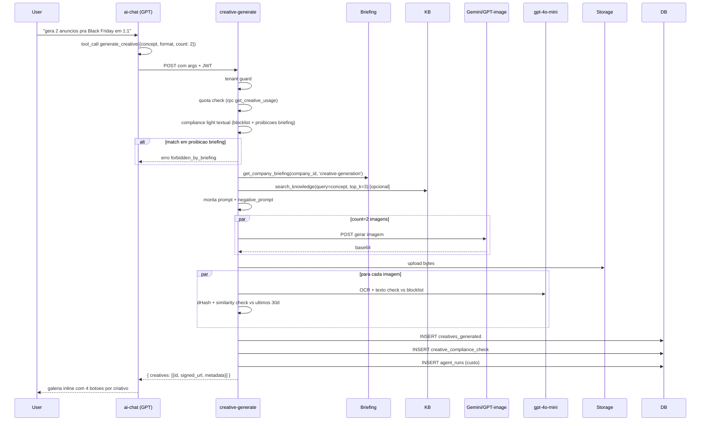
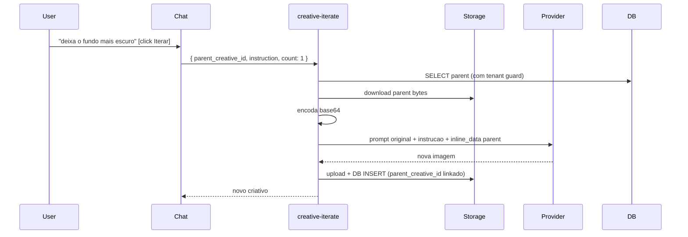
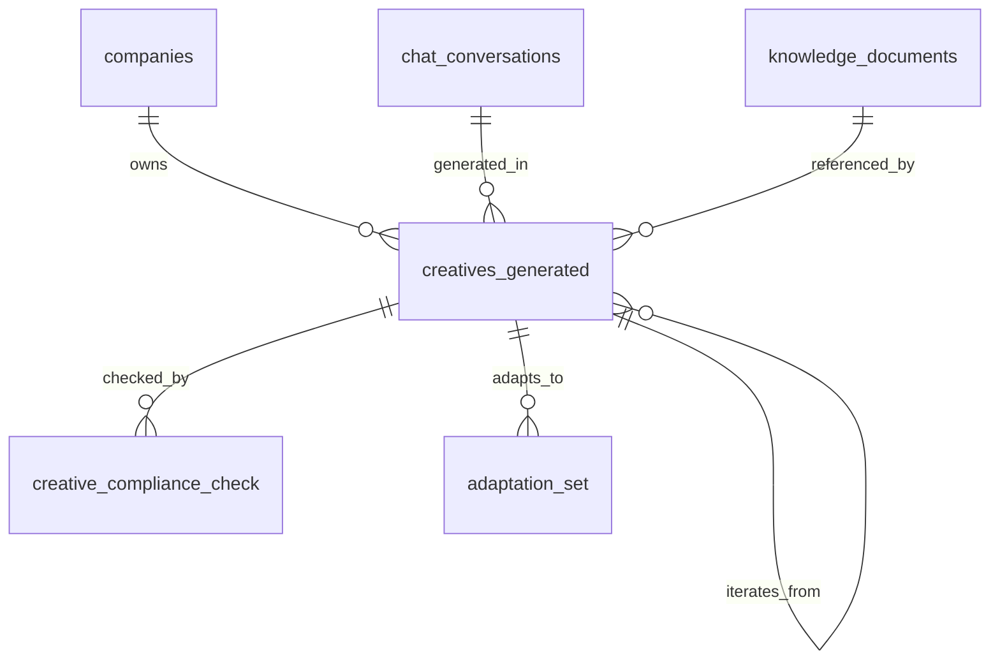

# Design Document — ai-creative-generation

## Overview

**Purpose**: Tool de geracao de criativos de anuncio (imagens) dentro do chat do Fury. Usuario pede em linguagem natural; IA monta prompt usando briefing + KB; chama provedor (Nano Banana 2 default ou GPT-image-1 upgrade); retorna galeria inline com botoes aprovar/iterar/variar/descartar; criativos aprovados vao para biblioteca "Estudio".

**Users**: Donos/admins geram via chat. Members tem somente leitura. IA do Fury invoca via tool calling.

**Impact**: Adiciona 4 tools ao chat (generate, iterate, vary, adapt), 1 Edge Function central (`creative-generate`), 1 bucket novo, 4 tabelas, 1 view "Estudio" + galeria inline no chat. Custo financeiro alto — quotas e compliance light sao gates obrigatorios.

### Goals
- Geracao contextual usando briefing + KB integrado
- Iteracao conversacional com img2img (sem seed)
- Multi-modelo Nano Banana (rapido) + GPT-image-1 (qualidade) com fallback
- Quotas conservadoras enforcadas + custo trackado em `agent_runs`
- Compliance light pre-geracao (textual) + pos-geracao (OCR)
- Cadeia de iteracao auditavel + pHash anti-duplicate

### Non-Goals
- Geracao de video (apenas imagem estatica em v1)
- Pre-flight Meta MARS completo (spec separada)
- Upload direto na Meta (delegado a `campaign-publish` existente)
- Editor pixel-level / inpaint manual (apenas via prompt)
- Templates pre-prontos / brand kit avancado (v2)

## Architecture

### Existing Architecture Analysis

- **Briefing**: `get_company_briefing(company_id, purpose='creative-generation')` ja retorna payload completo
- **KB**: `search_knowledge` ja existe; reusar com top_k=3 quando concept indicar tema especifico
- **Tool calling**: padrao `_shared/tools.ts` + handler em `ai-chat` ja estabelecido
- **agent_runs**: tracking de cost/tokens por chamada IA — reuso com `agent_name` em prefixo `creative-*`
- **Tenant guard**: `_shared/tenant-guard.ts` (generalizado em knowledge-base-rag)
- **Log redaction**: `_shared/log-redact.ts` (helpers ja existem)
- **Bucket pattern**: `chat-attachments` / `company-assets` / `knowledge-base` ja consolidaram template

### Architecture Pattern & Boundary Map

```mermaid
graph TB
    subgraph Frontend
        ChatView[ChatView]
        CreativeGallery[CreativeGalleryInline]
        StudioView[StudioView]
        useCreatives[useCreatives hook]
        useCreativeUsage[useCreativeUsage hook]
    end

    subgraph SupabasePostgres
        creatives_generated[(creatives_generated)]
        creative_iterations[(creative_iterations)]
        creative_compliance_check[(creative_compliance_check)]
        meta_baseline_blocklist[(meta_baseline_blocklist)]
        creative_plan_quotas[(creative_plan_quotas)]
        rpc_get_usage[get_creative_usage RPC]
        rpc_get_provenance[get_creative_provenance RPC]
        rpc_health[get_creative_health RPC]
    end

    subgraph SupabaseStorage
        gen_bucket[generated-creatives bucket]
        company_assets_bucket[company-assets bucket]
    end

    subgraph EdgeFunctions
        creative_generate[creative-generate]
        creative_iterate[creative-iterate]
        creative_export[creative-export ZIP]
    end

    subgraph External
        Gemini[Gemini 2.5 Flash Image]
        OpenAIImage[OpenAI gpt-image-1]
        OpenAIVision[OpenAI gpt-4o-mini OCR]
    end

    ChatView --> CreativeGallery
    StudioView --> useCreatives
    useCreatives --> creatives_generated
    useCreativeUsage --> rpc_get_usage

    ChatView -.tool call.-> creative_generate
    creative_generate --> creatives_generated
    creative_generate --> Gemini
    creative_generate --> OpenAIImage
    creative_generate --> OpenAIVision
    creative_generate --> gen_bucket
    creative_generate --> company_assets_bucket
    creative_generate --> creative_compliance_check
    creative_generate --> meta_baseline_blocklist
    creative_generate -.briefing.-> rpc_get_briefing[get_company_briefing]
    creative_generate -.KB.-> rpc_search_kb[search_knowledge]

    creative_iterate --> creative_iterations
    creative_iterate --> Gemini
    creative_iterate --> OpenAIImage

    creative_export --> creatives_generated
```



**Architecture Integration**:
- **Pattern**: Sincrono (count<=2) + async hibrido (count>=3) com fanout paralelo limitado
- **Boundaries**: Geracao isolada em `creative-generate` Edge Function; chat consome via tool calling
- **Existing patterns preserved**: tools.ts, agent_runs, tenant-guard, log-redact, RLS, bucket privado
- **New components**: 4 tabelas + 3 RPCs + 3 Edge Functions + 1 bucket + 2 hooks + 2 paginas/componentes
- **Steering compliance**: TS strict, sem `any`, componentes <200 linhas

### Technology Stack

| Layer | Choice / Version | Role | Notes |
|-------|-----------------|------|-------|
| Frontend | React 18 + TanStack Query v5 + shadcn/ui | UI Estudio + galeria inline | Reusa stack |
| Backend | Supabase Edge Functions (Deno) | creative-generate, creative-iterate, creative-export | Reusa `_shared/cors.ts`, `_shared/tenant-guard.ts`, `_shared/log-redact.ts` |
| Data | PostgreSQL 15 + RLS | 4 tabelas + 3 RPCs | Mesmo padrao knowledge-base-rag |
| External | Google Gemini 2.5 Flash Image, OpenAI gpt-image-1, OpenAI gpt-4o-mini | Geracao + OCR pos | Auth via env vars `GEMINI_API_KEY`, `OPENAI_API_KEY` |
| Image Processing | `imagescript@1.2.17` (Deno) | dHash + decode/resize | Zero deps nativas |
| Storage | Bucket privado `generated-creatives` | Bytes dos criativos | 5MB max por imagem (geradas em ~2-4MB) |

## System Flows

### Geracao via chat (sincrono count<=2)



### Iteracao (img2img)



## Requirements Traceability

| Requirement | Summary | Components | Interfaces | Flows |
|-------------|---------|------------|------------|-------|
| 1.1-1.7 | Tool generate_creative + briefing/KB integration | tools.ts, ai-chat handler, creative-generate | API + tool | Geracao chat |
| 2.1-2.6 | Multi-modelo + fallback + tracking | creative-generate (provider abstraction) | service | — |
| 3.1-3.5 | Iteracao conversacional + vary | creative-iterate, parent_creative_id FK | API | Iteracao |
| 4.1-4.4 | Adaptacao multi-aspecto | creative-generate (mode='adapt'), adaptation_set_id | API | — |
| 5.1-5.6 | Galeria inline + acoes | CreativeGalleryInline, useCreatives | State | — |
| 6.1-6.7 | Quotas + RPC usage | get_creative_usage, creative_plan_quotas | API + state | — |
| 7.1-7.6 | Biblioteca Estudio | StudioView, creative-export | UI | — |
| 8.1-8.4 | Auditoria + pHash + provenance | creatives_generated, dHash util, get_creative_provenance | service | — |
| 9.1-9.6 | Multi-tenant + bucket | RLS, bucket policies, tenant guard | — | — |
| 10.1-10.6 | Compliance light + OCR | meta_baseline_blocklist, creative_compliance_check | service | Geracao chat |
| 11.1-11.5 | Robustez + retry + health | get_creative_health RPC, retry logic | service | — |

## Components and Interfaces

### Summary

| Component | Layer | Intent | Req Coverage | Key Dependencies | Contracts |
|-----------|-------|--------|--------------|------------------|-----------|
| creative-generate | Edge Fn | Geracao com briefing + KB + multi-modelo | 1, 2, 4, 8, 10 | Gemini, OpenAI, Vision, briefing RPC, KB RPC, Storage | API |
| creative-iterate | Edge Fn | img2img a partir de parent | 3 | Storage, Provider, DB | API |
| creative-export | Edge Fn | ZIP de aprovados | 7.6 | Storage, DB | API |
| useCreatives | Frontend hook | CRUD biblioteca + galeria | 5, 7 | Supabase, Storage | Service |
| useCreativeUsage | Frontend hook | Quota + health | 6, 11 | RPC | Service |
| CreativeGalleryInline | UI | Galeria no chat com 4 botoes | 5 | useCreatives | State |
| StudioView | UI | Biblioteca permanente | 7 | useCreatives | State |
| get_creative_usage | RPC | Uso vs quotas | 6.5 | tabelas + agent_runs | API |
| get_creative_provenance | RPC | Arvore de iteracao | 8.4 | creatives_generated | API |
| get_creative_health | RPC | Sucesso/falha por provedor 24h | 11.5 | agent_runs | API |
| creatives_generated | Data | 1 row por imagem com metadata + pHash | 8 | companies | State |
| creative_iterations | Data | Audit de cadeia (alt: usar parent_creative_id direto) | 3.3 | — | State |
| creative_compliance_check | Data | Resultado de blocklist + OCR | 10.6 | — | State |
| meta_baseline_blocklist | Data | Termos Meta-sensiveis configuraveis | 10.1 | — | State |
| creative_plan_quotas | Data | Limites por plano de assinatura | 6.1 | — | State |
| Bucket generated-creatives | Storage | Bytes das imagens | 9.2 | — | State |

### Backend / Edge Functions

#### creative-generate

| Field | Detail |
|-------|--------|
| Intent | Recebe pedido do chat, valida, busca contexto, chama provedor (com fallback), processa imagens, persiste |
| Requirements | 1.1-1.7, 2.1-2.6, 4.1-4.4, 8.1-8.4, 10.1-10.6, 11.1-11.4 |

**Contracts**: API [x]

##### API Contract

| Method | Endpoint | Request | Response | Errors |
|--------|----------|---------|----------|--------|
| POST | `/functions/v1/creative-generate` | `GenerateRequest` | `GenerateResponse` | 401, 403 (forbidden_by_briefing/quota_exceeded), 422 (validation), 503 (provider_unavailable) |

```typescript
type AspectFormat = 'feed_1x1' | 'story_9x16' | 'reels_4x5';
type ModelChoice = 'auto' | 'nano_banana' | 'gpt_image';
type StyleHint = 'minimalista' | 'cinematografico' | 'clean' | 'lifestyle' | 'produto_em_uso';
type GenerateMode = 'create' | 'adapt';

interface GenerateRequest {
  concept: string;                          // descricao curta do que gerar
  format: AspectFormat;
  count: 1 | 2 | 3 | 4;
  style_hint?: StyleHint;
  use_logo?: boolean;                       // default true
  model?: ModelChoice;                      // default 'auto'
  mode?: GenerateMode;                      // 'create' default; 'adapt' usa source_creative_id
  source_creative_id?: string;              // obrigatorio se mode='adapt'
  conversation_id?: string;                 // para vincular ao chat
  idempotency_key?: string;                 // R11.4
  override_briefing_warning?: boolean;      // R1.6 confirmacao
  override_blocklist_warning?: boolean;     // R10.2 confirmacao
}

interface CreativeMetadata {
  id: string;
  signed_url: string;
  signed_url_expires_at: string;
  format: AspectFormat;
  model_used: 'gemini-2.5-flash-image' | 'gpt-image-1';
  cost_usd: number;
  width: number;
  height: number;
  is_near_duplicate: boolean;
  near_duplicate_of_id: string | null;
  compliance_warning: boolean;
}

interface GenerateResponse {
  creatives: CreativeMetadata[];
  failed_count: number;                     // R11.2 — partial result
  blocked_by_dedupe: number;                // R8.3 — bloqueados por pHash
  warnings: string[];                       // ex: aviso de quota >=80%
}
```

- **Preconditions**: tenant guard valida JWT; briefing min completo; quota nao 100%
- **Postconditions**: rows em `creatives_generated`, `creative_compliance_check`, `agent_runs`
- **Concurrency**: limite global de 5 chamadas paralelas por company a provedor (R4.5 spec original do KB padrao reuso)
- **Timeout**: 30s por imagem; 60s total

**Implementation Notes**
- Provider abstraction: funcao `callProvider(model, prompt, format, parentBytes?)` retorna `{ bytes, modelUsed, costUsd }`
- Fallback: try Nano Banana, on 5xx/timeout → try GPT-image-1 com flag fallback
- Compliance light textual roda antes do provider call; OCR pos roda em paralelo com upload do Storage
- pHash: `dHash(imageBytes)` usando `imagescript`; query SQL para dedupe nos ultimos 30d
- Idempotency: hash(idempotency_key) usado como `id` candidato; UPSERT detecta colisao

#### creative-iterate

| Field | Detail |
|-------|--------|
| Intent | Reusa creative-generate em modo img2img, alimentando parent como input visual |
| Requirements | 3.1-3.5 |

**Contracts**: API [x]

##### API Contract

```typescript
interface IterateRequest {
  parent_creative_id: string;
  instruction?: string;                     // texto da mudanca (vazio para regenerate)
  mode?: 'iterate' | 'regenerate' | 'vary';
  count?: 1 | 2 | 3;                         // 1 default; vary forca 3
  model?: ModelChoice;
}
type IterateResponse = GenerateResponse;
```

- Tenant guard valida que parent.company_id == user.company_id
- Baixa parent do bucket, encoda b64 inline, monta prompt usando parent.prompt + instruction
- Retorna em formato identico ao GenerateResponse para reuso de UI

#### creative-export

| Field | Detail |
|-------|--------|
| Intent | Gera ZIP de criativos aprovados em alta resolucao |
| Requirements | 7.6 |

**Contracts**: API [x]

```typescript
interface ExportRequest {
  creative_ids: string[];                   // max 50
}
interface ExportResponse {
  download_url: string;                     // signed URL TTL 5min
  expires_at: string;
}
```

### Frontend / Hooks

#### useCreatives

| Field | Detail |
|-------|--------|
| Intent | CRUD da biblioteca + acoes (aprovar/descartar/edit metadata) + galeria inline |
| Requirements | 5, 7 |

**Contracts**: Service [x]

```typescript
type CreativeStatus = 'generated' | 'approved' | 'discarded' | 'published';

interface Creative {
  id: string;
  company_id: string;
  conversation_id: string | null;
  parent_creative_id: string | null;
  adaptation_set_id: string | null;
  prompt: string;                           // pode ser ofuscado em log; visivel no detalhe
  format: AspectFormat;
  model_used: string;
  status: CreativeStatus;
  storage_path: string;
  width: number;
  height: number;
  cost_usd: number;
  phash: string;                            // hex 16 chars
  is_near_duplicate: boolean;
  compliance_warning: boolean;
  ready_for_publish: boolean;
  title: string | null;
  tags: string[];
  description: string | null;
  created_at: string;
  signed_url?: string;
}

type CreativeError =
  | { kind: 'unauthorized' }
  | { kind: 'quota_exceeded' }
  | { kind: 'forbidden_by_briefing' }
  | { kind: 'provider_unavailable' }
  | { kind: 'duplicate_blocked'; existing_id: string }
  | { kind: 'network'; message: string };

type Result<T, E> = { ok: true; value: T } | { ok: false; error: E };

interface UseCreativesReturn {
  creatives: Creative[];
  isLoading: boolean;
  isReadOnly: boolean;
  filter: (f: Partial<{ status: CreativeStatus[]; format: AspectFormat[]; offer: string; from: string; to: string }>) => void;
  approve: (id: string) => Promise<Result<Creative, CreativeError>>;
  discard: (id: string) => Promise<Result<void, CreativeError>>;
  updateMetadata: (id: string, patch: Partial<Pick<Creative, 'title' | 'tags' | 'description' | 'ready_for_publish'>>) => Promise<Result<Creative, CreativeError>>;
  iterate: (parentId: string, instruction: string) => Promise<Result<Creative[], CreativeError>>;
  vary: (parentId: string) => Promise<Result<Creative[], CreativeError>>;
  exportZip: (ids: string[]) => Promise<Result<{ url: string }, CreativeError>>;
}
```

#### useCreativeUsage

| Field | Detail |
|-------|--------|
| Intent | Quotas + health |
| Requirements | 6.5, 11.5 |

```typescript
interface CreativeUsage {
  daily: { count: number; max: number };
  monthly: { count: number; max: number };
  cost_usd_month: { value: number; max: number };
  status: 'ok' | 'warning' | 'blocked';
  warning_dimensions: ('daily' | 'monthly' | 'cost')[];
  blocked_dimensions: ('daily' | 'monthly' | 'cost')[];
}

interface CreativeHealth {
  nano_banana_24h: { success: number; failed: number };
  gpt_image_24h: { success: number; failed: number };
  p95_latency_ms: number;
}
```

### UI / Pages

| Component | Block Type | Notes |
|-----------|-----------|-------|
| CreativeGalleryInline | Summary-only | Renderizado quando ai-chat retorna `creatives` na tool response. 4 botoes por item, lightbox |
| StudioView | Summary-only | Pagina dedicada com filtros + grid de criativos + bulk actions |
| CreativeUsageBanner | Summary-only | Topo do StudioView quando warning/blocked |
| CreativeDetailDialog | Summary-only | Click em qualquer criativo abre dialog com prompt completo, parent chain (provenance), download |

### Backend / RPCs

#### get_creative_usage(company_id)

Retorna jsonb compatible com `CreativeUsage`. Calcula:
- daily: COUNT criativos do dia em `creatives_generated`
- monthly: COUNT do mes
- cost_usd_month: SUM `cost_usd` em agent_runs com `agent_name LIKE 'creative-%'` no mes
- Quotas via JOIN com `creative_plan_quotas` por `organizations.plan`
- `SECURITY INVOKER`

#### get_creative_provenance(creative_id)

Retorna jsonb com:
- chain: array de criativos seguindo `parent_creative_id` ate raiz
- briefing_snapshot_summary: campos chave usados na geracao raiz
- knowledge_chunks: ids dos chunks da KB usados
- `SECURITY INVOKER` — RLS aplica

#### get_creative_health()

Retorna jsonb com sucesso/falha por provedor nas ultimas 24h + p95 latency. Le `agent_runs` filtrando `agent_name LIKE 'creative-%'`. Aberto a authenticated.

## Data Models

### Domain Model
- **Aggregate root**: `Creative` (1 row por imagem).
- **Invariantes**:
  - `mode='adapt'` → `adaptation_set_id` populado e `parent_creative_id` aponta para origem
  - `parent_creative_id` so referencia mesma `company_id` (RLS valida)
  - `phash` sempre 16 chars hex (64-bit dHash)
  - Status transitions: generated → approved → published; ou generated → discarded; nunca volta atras
- **Domain events** (emitidos como log estruturado): `CreativeGenerated`, `CreativeApproved`, `CreativeDiscarded`, `QuotaWarningHit`, `ProviderFallbackTriggered`

### Logical Data Model



### Physical Data Model

| Tabela | Colunas-chave | Indexes | RLS |
|--------|--------------|---------|-----|
| `creatives_generated` | `id PK`, `company_id FK`, `conversation_id FK?`, `parent_creative_id FK?`, `adaptation_set_id`, `idempotency_key UNIQUE?`, `prompt text`, `concept text`, `format`, `model_used`, `provider_model_version`, `status`, `storage_path UNIQUE`, `mime_type`, `width`, `height`, `cost_usd numeric`, `latency_ms`, `phash text(16)`, `is_near_duplicate bool`, `near_duplicate_of_id FK?`, `compliance_warning bool`, `ready_for_publish bool`, `title`, `tags text[]`, `description`, `briefing_snapshot jsonb`, `kb_chunk_ids uuid[]`, `created_at`, `updated_at` | `(company_id, created_at DESC)`, `(company_id, status)`, GIN `tags`, `(company_id, phash)` para dedupe, `parent_creative_id` | SELECT/UPDATE: tenant. INSERT: tenant + role IN (owner,admin). DELETE: bloqueado (apenas via discard) |
| `creative_compliance_check` | `id PK`, `creative_id FK`, `baseline_hits text[]`, `briefing_hits text[]`, `ocr_hits text[]`, `passed bool`, `created_at` | `creative_id` | SELECT por tenant; INSERT via service_role |
| `meta_baseline_blocklist` | `term PK`, `category` (claim_garantia, antes_depois, saude, financeiro), `severity` (warn, block_unless_override), `created_at` | — | Read publico authenticated; UPDATE somente service_role |
| `creative_plan_quotas` | `plan PK`, `creatives_per_day_max`, `creatives_per_month_max`, `cost_usd_per_month_max numeric` | — | Read publico authenticated |

**Storage**: bucket privado `generated-creatives`, file_size_limit 5MB, allowed_mime: png/webp/jpeg. Path: `{company_id}/{creative_id}.{ext}`. Policies replicam padrao do projeto (4 policies por path por company).

**Plans seed inicial**:
| plan | creatives/dia | creatives/mes | cost/mes |
|---|---|---|---|
| free | 5 | 25 | $2 |
| pro | 25 | 250 | $25 |
| enterprise | 100 | 1000 | $100 |

**Baseline blocklist seed** (exemplos):
- "antes e depois" (severity=block_unless_override)
- "100% garantido" (block)
- "cura definitiva" (block)
- "voce esta acima do peso" (block)
- "ganhe X reais em Y dias" (block)
- "milagre" (warn)

## Error Handling

### Error Strategy
- Fail-fast no client (Zod) antes de qualquer fetch
- Fail-closed na tool: provider error → retry exponencial → fallback → erro claro sem cobrar quota
- Compliance light bloqueia ANTES do provider call (poupa $)

### Error Categories

- **User errors (4xx)**:
  - `briefing_incomplete` (R1.2) — 422 com missing_fields
  - `forbidden_by_briefing` (R1.6) — 403 com proibicao violada
  - `quota_exceeded` (R6.4) — 403 com dimension
  - `forbidden_by_blocklist` (R10.2) — 403, exige confirm
- **System errors (5xx)**:
  - `provider_unavailable` (R2.4) — 503 com retry-after
  - `partial_failure` (R11.2) — 200 com `failed_count > 0`
- **Business logic**:
  - `duplicate_blocked` (R8.3) — 409 com `existing_id`

### Monitoring
- `agent_runs` com agent_name=`creative-nano-banana` ou `creative-gpt-image` — feed do Saude do AI
- Logs estruturados via `logCreativeAccess({ companyId, event, modelUsed, cost, durationMs, status })`
- Alarmes: p95 > 30s, fallback rate > 10%, provider availability < 95%

## Testing Strategy

### Unit Tests
- `dHash`: 4 cenarios — imagem identica (dist=0), variacao leve (dist<=3), diferente (dist>10)
- Quota calculator: warning em 80%, block em 100%, dimensoes corretas
- Compliance light textual: matchs em concept/instruction, casos com override
- Schema Zod: GenerateRequest valido/invalido, IterateRequest

### Integration Tests
- Geracao end-to-end: briefing minimo + concept simples → criativo persistido + agent_run + compliance_check
- Fallback Nano→GPT: simular Nano 503 → confirma flag fallback=true e custo cobrado correto
- pHash dedupe: gerar imagem identica 2x → segunda bloqueada com `existing_id` retornado
- Iteracao img2img: parent + instruction → novo criativo com parent_creative_id linkado
- Quota: bloqueio em 100%, libera apos delete

### E2E Tests
- Fluxo conversacional: usuario pede no chat → tool roda → galeria inline aparece → click aprovar → criativo na biblioteca Estudio
- Cross-tenant: usuario A nao ve criativos da company B (RLS)
- Member sem write: tenta gerar → 403

### Performance
- p95 generate count=1 Nano Banana: <8s
- p95 generate count=1 GPT-image high: <20s
- p95 iterate count=1: <12s
- dHash 1024x1024: <500ms

## Security Considerations
- RLS em todas as tabelas; bucket policies por path
- API keys (`GEMINI_API_KEY`, `OPENAI_API_KEY`) APENAS em env do Supabase — nunca no front
- Rate limiting por company (max 5 chamadas paralelas a provedor) — defense em depth contra abuso de tokens
- Tenant guard nas Edge Functions (R9.4 padrao do projeto)
- Log redaction: `prompt` so em DB (sob RLS); logs estruturados omitem prompt cru
- Member readonly enforced por role check + RLS UPDATE policy

## Performance & Scalability
- Concurrency limit 5 chamadas paralelas por company (R4.5 estilo KB)
- TanStack Query staleTime 2min para `creatives` listing
- Indice `(company_id, phash)` para dedupe rapido
- Bucket lifecycle: limpar `discarded` apos 90 dias (cron futuro)
- Alvo: p95 generate <20s end-to-end
