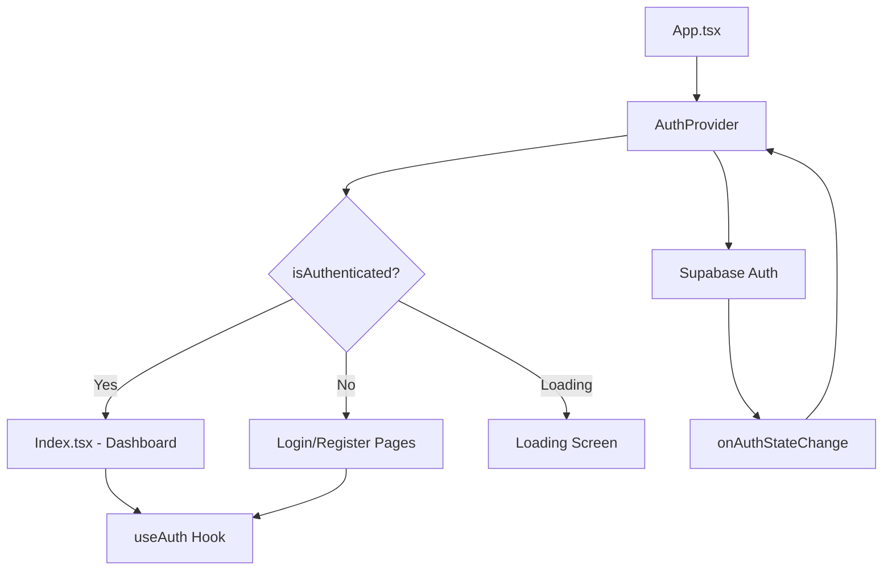
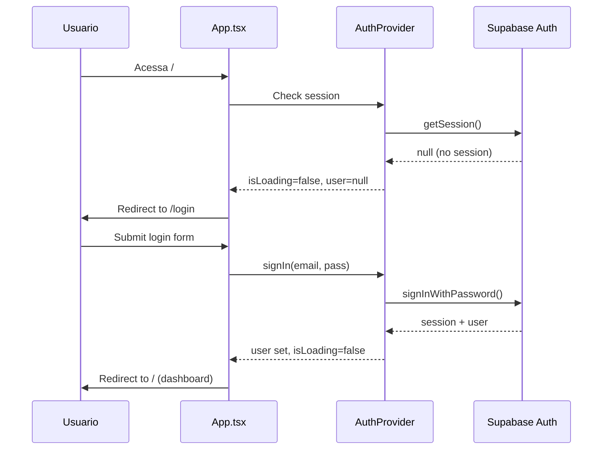

# Design: Auth Flow (Supabase Auth)

## Overview

**Purpose**: Implementar autenticacao com Supabase Auth para proteger o ClickHero, garantindo que apenas usuarios autenticados acessem o dashboard e funcionalidades de gestao de campanhas Meta Ads.

**Users**: Gestores de trafego e anunciantes que usam Meta Ads.

**Impact**: Transforma o app de acesso publico para acesso autenticado, habilitando RLS por usuario.

### Goals
- Registro e login com email/senha via Supabase Auth
- Protecao de rotas com redirect automatico
- AuthContext centralizado com hook `useAuth()`
- UX fluida sem flash de conteudo nao autorizado

### Non-Goals
- Login social (Google, Facebook) — feature futura
- Reset de senha — feature futura
- Verificacao de email — feature futura
- Multi-tenancy / organizacoes — feature futura

## Architecture

### Architecture Pattern & Boundary Map



### Technology Stack

| Layer | Choice | Role | Notes |
|-------|--------|------|-------|
| Auth Provider | Supabase Auth | Autenticacao | Email/senha, session management |
| State | React Context | Auth state global | AuthProvider + useAuth hook |
| Forms | React Hook Form + Zod | Validacao | Login e Register forms |
| Routing | React Router | Protecao de rotas | ProtectedRoute wrapper |
| UI | shadcn/ui | Forms e feedback | Input, Button, Form, Toast |

## Components and Interfaces

| Component | Layer | Intent | Req Coverage |
|-----------|-------|--------|--------------|
| AuthProvider | Context | Gerencia estado de auth global | 4, 5 |
| useAuth | Hook | Acesso a auth em qualquer componente | 5 |
| LoginPage | Page | Formulario de login | 2 |
| RegisterPage | Page | Formulario de registro | 1 |
| ProtectedRoute | Component | Wrapper que protege rotas | 4 |

### Context Layer

#### AuthProvider + useAuth

| Field | Detail |
|-------|--------|
| Intent | Gerenciar estado de autenticacao global |
| Requirements | 4, 5 |

**State Management**
```typescript
interface AuthContextType {
  user: User | null;
  session: Session | null;
  isLoading: boolean;
  signIn: (email: string, password: string) => Promise<void>;
  signUp: (email: string, password: string) => Promise<void>;
  signOut: () => Promise<void>;
}
```

**Location**: `src/contexts/AuthContext.tsx` + `src/hooks/use-auth.ts`

### Page Layer

#### LoginPage

| Field | Detail |
|-------|--------|
| Intent | Formulario de login com email/senha |
| Requirements | 2 |

**Location**: `src/pages/Login.tsx`

**Zod Schema**:
```typescript
const loginSchema = z.object({
  email: z.string().email('Email invalido'),
  password: z.string().min(6, 'Senha deve ter pelo menos 6 caracteres'),
});
```

#### RegisterPage

| Field | Detail |
|-------|--------|
| Intent | Formulario de registro com confirmacao de senha |
| Requirements | 1 |

**Location**: `src/pages/Register.tsx`

**Zod Schema**:
```typescript
const registerSchema = z.object({
  email: z.string().email('Email invalido'),
  password: z.string().min(6, 'Senha deve ter pelo menos 6 caracteres'),
  confirmPassword: z.string(),
}).refine(data => data.password === data.confirmPassword, {
  message: 'As senhas nao coincidem',
  path: ['confirmPassword'],
});
```

### Component Layer

#### ProtectedRoute

| Field | Detail |
|-------|--------|
| Intent | Wrapper que redireciona para /login se nao autenticado |
| Requirements | 4 |

**Location**: `src/components/auth/ProtectedRoute.tsx`

**Logic**:
```
if (isLoading) → render Loading screen
if (!user) → redirect to /login
else → render children
```

## System Flows



## Error Handling

### Error Categories
- **Auth Errors** (Supabase): Invalid credentials, email already registered, weak password
- **Network Errors**: Supabase unreachable → toast com "Erro de conexao"
- **Session Errors**: Token expired → redirect to /login

## Testing Strategy

### Unit Tests
- AuthProvider renders children when authenticated
- useAuth returns correct state
- Zod schemas validate correctly

### Integration Tests
- Login flow: form → submit → redirect
- Register flow: form → submit → redirect
- Protected route: unauthenticated → redirect to /login
- Logout: click → session cleared → redirect to /login
