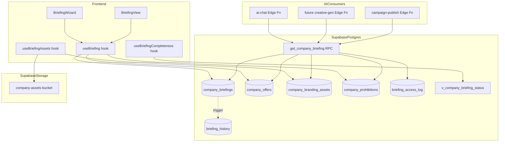
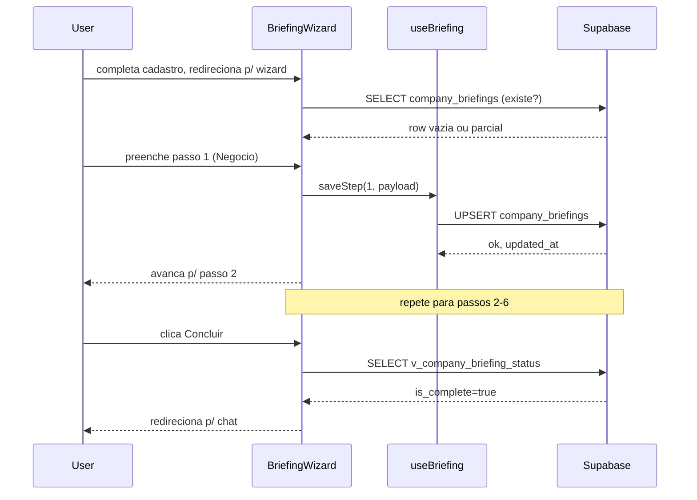
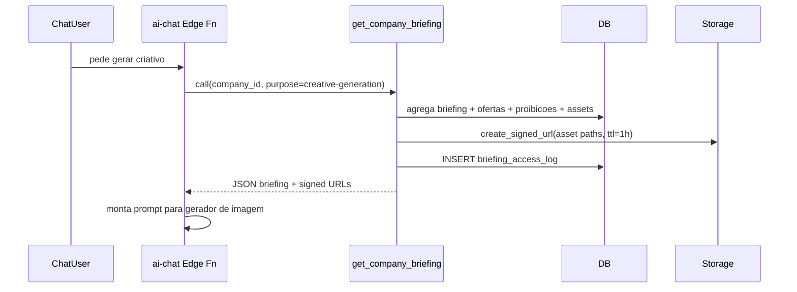
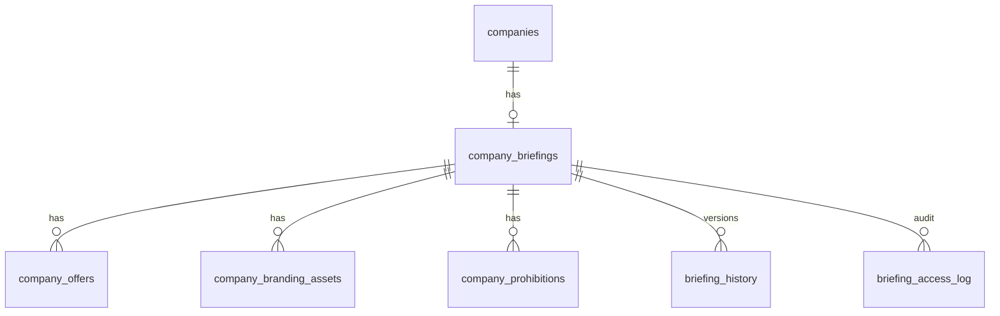

# Design Document — briefing-onboarding

## Overview

**Purpose**: Esta feature entrega ao Fury a fonte canonica de contexto de negocio do cliente — nicho, ofertas, publico, tom, identidade visual, proibicoes — coletada via wizard pos-cadastro, editavel a qualquer momento e exposta a camadas de IA via RPC agregadora.

**Users**: Donos/admins de empresa preenchem e mantem o briefing. A IA (chat, gerador de criativo, publicador de campanha) consome o briefing para gerar output contextualizado.

**Impact**: Estende o modelo `companies` existente sem polui-lo, adiciona o bucket privado `company-assets`, introduz o hook `use-briefing-completeness` como gate funcional para features que dependem de contexto.

### Goals
- Coletar briefing minimo viavel em ate 6 passos com auto-save por passo
- Garantir leitura agregada do briefing pela IA em <200ms p95
- Bloquear geracao de criativo e publicacao de campanha enquanto briefing estiver incompleto
- Isolar briefing por tenant via RLS e Storage policies

### Non-Goals
- RAG sobre documentos arbitrarios do cliente (escopo de `knowledge-base-rag`)
- Geracao de criativos com IA (escopo de `ai-creative-generation`)
- Analise automatica de Instagram/TikTok do cliente (so armazenamos URL)
- Pre-flight de compliance (escopo de spec dedicada; aqui apenas expomos as proibicoes)
- Onboarding multi-step alem dos 6 passos definidos

## Architecture

### Existing Architecture Analysis

- **Multi-tenant**: `organizations` -> `organization_members` -> `companies` (bridge `20260404000001`); funcao `current_user_company_id()` ja resolve company a partir do JWT
- **Padrao RLS**: todas as tabelas filhas de `companies` aplicam policies via `current_user_company_id()`
- **Storage privado**: bucket `chat-attachments` (`20260426000001`) e o template a seguir — bucket privado + policies por path `{company_id}/...`
- **TanStack Query** e padrao para server state; `useEffect+fetch` proibido
- **Forms**: React Hook Form + Zod (em `Register.tsx`)

### Architecture Pattern & Boundary Map



**Architecture Integration**:
- **Selected pattern**: Domain-driven com tabelas normalizadas + RPC agregadora para consumidores IA
- **Domain boundaries**: Briefing e bounded context proprio; consumidores IA dependem apenas da RPC publica `get_company_briefing`, nao das tabelas
- **Existing patterns preserved**: RLS via `current_user_company_id()`, bucket privado com policies por path, hooks com TanStack Query, RHF+Zod
- **New components rationale**: 4 tabelas + 2 view/RPC + 1 bucket sao minimo necessario para suportar 1:N de ofertas + versionamento + audit
- **Steering compliance**: TypeScript strict, `any` proibido, componentes <200 linhas, 4 estados visuais obrigatorios em hooks de dados

### Technology Stack

| Layer | Choice / Version | Role in Feature | Notes |
|-------|------------------|-----------------|-------|
| Frontend | React 18 + Vite 5, TanStack Query v5, RHF ^7 + Zod ^3, shadcn/ui | Wizard, BriefingView, hooks de leitura/escrita | Reusa stack existente |
| Backend / Services | Supabase Edge Functions (Deno) — opcional para signed URLs em batch | Apenas se signed URLs em massa precisarem batching | Default: gerar via RPC inline |
| Data / Storage | PostgreSQL 15 (Supabase), pgcrypto p/ UUID, triggers | 4 tabelas + 1 view + 1 RPC + bucket Storage privado | Bucket `company-assets` novo |
| Infra / Runtime | Supabase Auth (JWT) + RLS | Isolamento tenant | `current_user_company_id()` |

## System Flows

### Fluxo: Wizard pos-cadastro com auto-save



### Fluxo: IA consumindo briefing antes de gerar criativo



## Requirements Traceability

| Requirement | Summary | Components | Interfaces | Flows |
|-------------|---------|------------|------------|-------|
| 1.1, 1.2, 1.3 | Wizard 6 passos com auto-save | BriefingWizard, useBriefing | `useBriefing.saveStep` | Wizard pos-cadastro |
| 1.4, 8.3, 8.4 | Skip + bloqueio funcional | useBriefingCompleteness, v_company_briefing_status | `useBriefingCompleteness()` | — |
| 1.5, 8.1 | Indicador de progresso / score | BriefingProgress, v_company_briefing_status | `v_company_briefing_status` | — |
| 2.1–2.6 | Negocio + ofertas | company_briefings, company_offers | `useBriefing`, `useOffers` | — |
| 3.1–3.6 | Publico + tom de voz | company_briefings (campos audience/tone) | `useBriefing` | — |
| 4.1–4.6 | Identidade visual | company_branding_assets, bucket company-assets, useBriefingAssets | `useBriefingAssets` | — |
| 5.1–5.6 | Proibicoes | company_prohibitions, regulated_vertical_defaults | `useProhibitions` | — |
| 6.1–6.6 | Edicao + versionamento | BriefingView, briefing_history (trigger) | `useBriefing.update` | — |
| 7.1–7.6 | Exposicao para IA | get_company_briefing RPC, briefing_access_log | RPC `get_company_briefing(uuid, text)` | IA consumindo briefing |
| 8.2, 8.5, 8.6 | Calculo de completude | v_company_briefing_status | `v_company_briefing_status` | — |
| 9.1–9.6 | RLS + Storage policies | RLS em todas tabelas, Storage policies | — | — |

## Components and Interfaces

### Summary

| Component | Domain/Layer | Intent | Req Coverage | Key Dependencies (P0/P1) | Contracts |
|-----------|--------------|--------|--------------|--------------------------|-----------|
| BriefingWizard | UI / Page | Conduz wizard 6 passos com auto-save | 1.1–1.6, 2–5 | useBriefing (P0), useBriefingAssets (P0) | State |
| BriefingView | UI / Page | Edicao livre apos completude | 6.1–6.6 | useBriefing (P0) | State |
| useBriefing | Frontend / Hook | CRUD do briefing principal e ofertas | 1, 2, 3, 5, 6 | Supabase client (P0) | Service |
| useBriefingAssets | Frontend / Hook | Upload/listagem/remocao assets visuais | 4.1–4.6 | Supabase Storage (P0) | Service |
| useBriefingCompleteness | Frontend / Hook | Score + bloqueio funcional | 8.1, 8.3, 8.4 | v_company_briefing_status (P0) | Service |
| company_briefings | Data | Tabela 1:1 com companies guardando briefing | 2, 3, 6 | companies (P0) | State |
| company_offers | Data | 1:N de ofertas | 2.2, 2.3, 2.6, 6.6 | company_briefings (P0) | State |
| company_branding_assets | Data | Metadata dos arquivos visuais | 4.1, 4.3, 4.4 | company_briefings (P0), Storage (P0) | State |
| company_prohibitions | Data | Lista de proibicoes (palavras/assuntos/visuais) | 5.1–5.6 | company_briefings (P0) | State |
| briefing_history | Data | Snapshot versionado | 6.2, 6.3 | trigger AFTER UPDATE (P0) | State |
| briefing_access_log | Data | Audit de leituras pela IA | 7.6 | RPC (P0) | State |
| v_company_briefing_status | Data / View | Calcula score + is_complete | 8.1, 8.2, 8.5, 8.6 | tabelas acima (P0) | State |
| get_company_briefing | API / RPC | Leitura agregada para IA | 7.1–7.6 | tabelas + Storage signed URLs (P0) | API |

### Frontend / Hooks

#### useBriefing

| Field | Detail |
|-------|--------|
| Intent | Hook canonico para ler/atualizar briefing principal e ofertas |
| Requirements | 1.3, 2.1, 2.6, 3.1, 5.1, 6.1, 6.2, 6.4, 6.5, 6.6 |

**Responsibilities & Constraints**
- Unica porta de escrita do briefing no frontend
- Garante invalidacao de cache em 3 query keys: `briefing`, `briefing-status`, `offers`
- Owners por papel: `member` recebe `readOnly: true`

**Dependencies**
- Inbound: BriefingWizard, BriefingView (P0)
- Outbound: Supabase client (P0)
- External: nenhuma

**Contracts**: Service [x]

##### Service Interface

```typescript
type BriefingStatus = 'not_started' | 'incomplete' | 'complete';
type ToneScale = 1 | 2 | 3 | 4 | 5;
type EmotionalTone = 'aspirational' | 'urgent' | 'welcoming' | 'authoritative' | 'fun' | 'rational';

interface CompanyBriefing {
  companyId: string;
  niche: string | null;
  nicheCategory: string | null;
  shortDescription: string | null;
  websiteUrl: string | null;
  socialLinks: { instagram?: string; facebook?: string; tiktok?: string };
  audience: {
    ageRange: { min: number; max: number } | null;
    gender: 'male' | 'female' | 'mixed' | null;
    location: { country: string; state?: string; city?: string } | null;
    occupation: string | null;
    incomeRange: 'low' | 'mid' | 'high' | 'premium' | null;
    awarenessLevel: 1 | 2 | 3 | 4 | 5 | null;
    interests: string[];
    behaviors: string[];
    languageSamples: string[];
  };
  tone: {
    formality: ToneScale;
    technicality: ToneScale;
    emotional: EmotionalTone[];
    preferredCtas: string[];
    forbiddenPhrases: string[];
  };
  status: BriefingStatus;
  completenessScore: number;
  updatedAt: string;
  readOnly: boolean;
}

interface CompanyOffer {
  id: string;
  companyId: string;
  isPrimary: boolean;
  name: string;
  shortDescription: string;
  price: number;
  currency: 'BRL' | 'USD' | 'EUR';
  format: 'course' | 'service' | 'physical' | 'saas' | 'other';
  salesUrl: string | null;
  painsResolved: string[];
  benefits: string[];
  socialProof: { testimonials: string[]; impactNumbers: string[]; partnerLogos: string[] };
  position: number;
}

type BriefingError =
  | { kind: 'unauthorized' }
  | { kind: 'validation'; fields: string[] }
  | { kind: 'conflict'; reason: 'must_keep_one_primary_offer' }
  | { kind: 'network' };

type Result<T, E> = { ok: true; value: T } | { ok: false; error: E };

interface UseBriefingReturn {
  briefing: CompanyBriefing | null;
  offers: CompanyOffer[];
  isLoading: boolean;
  isError: boolean;
  saveStep: (step: 1 | 2 | 3 | 4 | 5 | 6, partial: Partial<CompanyBriefing>) => Promise<Result<CompanyBriefing, BriefingError>>;
  upsertOffer: (offer: Partial<CompanyOffer> & { id?: string }) => Promise<Result<CompanyOffer, BriefingError>>;
  removeOffer: (offerId: string) => Promise<Result<void, BriefingError>>;
  promoteOfferToPrimary: (offerId: string) => Promise<Result<void, BriefingError>>;
}
```

- Preconditions: usuario autenticado e membro de uma `company`
- Postconditions: writes invalidam queries `briefing`, `briefing-status`, `offers`
- Invariants: sempre exatamente uma `company_offers.is_primary = true` por company quando count > 0

**Implementation Notes**
- Integration: usar `supabase.from('company_briefings').upsert(...)` com `onConflict: 'company_id'`
- Validation: schema Zod por passo do wizard, schemas exportados para reuso
- Risks: race condition em multiple-tab; usar `updated_at` como optimistic concurrency check

#### useBriefingAssets

| Field | Detail |
|-------|--------|
| Intent | Upload, listagem e remocao de logos e mood board |
| Requirements | 4.1, 4.2, 4.3, 4.4, 4.5, 4.6 |

**Contracts**: Service [x]

##### Service Interface

```typescript
type AssetKind = 'logo_primary' | 'logo_alt' | 'mood_board';
type AssetMime = 'image/png' | 'image/jpeg' | 'image/webp' | 'image/svg+xml';

interface BrandingAsset {
  id: string;
  companyId: string;
  kind: AssetKind;
  storagePath: string;
  mimeType: AssetMime;
  sizeBytes: number;
  width: number | null;
  height: number | null;
  signedUrl: string | null;
  createdAt: string;
}

type AssetError =
  | { kind: 'too_large'; maxBytes: number }
  | { kind: 'unsupported_mime' }
  | { kind: 'mood_board_limit_reached'; max: 10 }
  | { kind: 'unauthorized' }
  | { kind: 'network' };

interface UseBriefingAssetsReturn {
  assets: BrandingAsset[];
  isLoading: boolean;
  upload: (file: File, kind: AssetKind) => Promise<Result<BrandingAsset, AssetError>>;
  remove: (assetId: string) => Promise<Result<void, AssetError>>;
  refreshSignedUrls: () => Promise<void>;
}
```

- Preconditions: arquivo <= 5MB, mime em allowlist
- Postconditions: row em `company_branding_assets` + objeto em `company-assets/{company_id}/branding/{kind}/{uuid}.{ext}`
- Invariants: somente um `logo_primary` e um `logo_alt` por company; mood board <=10

**Implementation Notes**
- Validation: validacoes client-side + RLS policy enforcement no backend (defense in depth)
- Risks: orfaos em Storage se delete da row falhar; usar Edge Function `cleanup-orphan-assets` agendada (fora desta spec)

#### useBriefingCompleteness

| Field | Detail |
|-------|--------|
| Intent | Provider unico de estado de completude consumido por features dependentes |
| Requirements | 8.1, 8.3, 8.4, 8.5, 8.6 |

**Contracts**: Service [x]

##### Service Interface

```typescript
interface BriefingCompletenessState {
  status: BriefingStatus;
  score: number;                  // 0-100
  isComplete: boolean;
  missingFields: BriefingMissingField[];
  blocksCreativeGeneration: boolean;
  blocksCampaignPublish: boolean;
}

type BriefingMissingField =
  | 'niche' | 'short_description' | 'primary_offer'
  | 'audience_age' | 'audience_location'
  | 'tone_formality' | 'tone_technicality' | 'tone_emotional'
  | 'visual_identity';

interface UseBriefingCompletenessReturn extends BriefingCompletenessState {
  isLoading: boolean;
  refetch: () => Promise<void>;
}
```

**Implementation Notes**
- Single source: le da view `v_company_briefing_status`. Frontend nao recalcula score.
- Cache: TanStack Query staleTime 5min; invalidado pelos mutations de `useBriefing` e `useBriefingAssets`

### UI / Pages

| Component | Block Type | Notes |
|-----------|-----------|-------|
| BriefingWizard | Summary-only | 6 sub-componentes (`StepBusiness`, `StepOffers`, `StepAudience`, `StepTone`, `StepVisuals`, `StepProhibitions`) — cada um <200 linhas, RHF+Zod, salva via `useBriefing` |
| BriefingView | Summary-only | Render acordeao das 6 secoes em modo edicao inline; usa o mesmo conjunto de schemas Zod |
| BriefingCompletenessBanner | Summary-only | Banner persistente quando `isComplete=false`; exibe `missingFields` e CTA |

### Data / API

#### get_company_briefing (RPC)

| Field | Detail |
|-------|--------|
| Intent | Retorna briefing completo + signed URLs para assets, em uma chamada |
| Requirements | 7.1, 7.2, 7.3, 7.4, 7.5, 7.6 |

**Contracts**: API [x]

##### API Contract

| Method | Endpoint | Request | Response | Errors |
|--------|----------|---------|----------|--------|
| RPC | `rpc/get_company_briefing` | `{ p_company_id: uuid, p_purpose: text }` | `BriefingPayload` JSON | 401 (unauthorized), 404 (company not found) |

```typescript
type BriefingPurpose = 'chat' | 'creative-generation' | 'campaign-publish' | 'compliance-preflight';

interface BriefingPayload {
  isComplete: boolean;
  status: BriefingStatus;
  business: { niche: string | null; description: string | null; website: string | null; social: Record<string, string> };
  primaryOffer: CompanyOffer | null;
  secondaryOffers: CompanyOffer[];
  audience: CompanyBriefing['audience'];
  tone: CompanyBriefing['tone'];
  visualIdentity: {
    logoPrimary: { signedUrl: string; expiresAt: string } | null;
    logoAlt: { signedUrl: string; expiresAt: string } | null;
    palette: { primary: string | null; secondary: string | null; accent: string | null; background: string | null };
    moodBoard: Array<{ signedUrl: string; expiresAt: string }>;
  };
  prohibitions: { words: string[]; topics: string[]; visualRules: string[] };
  meta: { fetchedAt: string; cacheTtlSeconds: number };
}
```

- Preconditions: RPC `SECURITY INVOKER` — RLS valida `company_id`; `auth.uid()` deve pertencer a `company_id`
- Postconditions: insert em `briefing_access_log` com `purpose`
- Invariants: signed URLs sempre com `expires_at` futuro; nunca retorna paths brutos
- p95 latencia alvo: <200ms (R7.2)

**Implementation Notes**
- Validation: rejeitar se `p_purpose` fora do enum
- Risks: gerar signed URLs em massa (mood board) custa N chamadas a `storage.create_signed_url` — limitar a 10 por company (alinhado a R4.3)

## Data Models

### Domain Model
- **Aggregate root**: `CompanyBriefing` (1:1 com `companies`). Inclui sub-aggregates `Offer` (1:N), `BrandingAsset` (1:N), `Prohibition` (1:N por categoria).
- **Invariantes**:
  - Exatamente uma `company_offers.is_primary = true` quando count(offers) > 0
  - `company_branding_assets` tem no maximo 1 `logo_primary` e 1 `logo_alt` por company
  - Score de completude = funcao deterministica dos campos preenchidos (em SQL)
- **Domain events**: `BriefingCompleted`, `BriefingUpdated` (consumidos via trigger -> `briefing_history`)

### Logical Data Model



- **Cardinalidade**: company_briefings 1:1 companies; demais 1:N
- **Cascade**: ON DELETE CASCADE em todas as filhas quando `companies` e removida
- **Versionamento**: trigger AFTER UPDATE em `company_briefings` snapshota em `briefing_history`; cron diario remove entradas alem das 20 mais recentes por company
- **Audit**: `briefing_access_log` retem por 90 dias (cron de limpeza fora desta spec)

### Physical Data Model

**Tabelas (PostgreSQL/Supabase)**:

| Tabela | Colunas-chave | Indexes | RLS |
|--------|--------------|---------|-----|
| `company_briefings` | `company_id PK`, `niche`, `short_description`, `website_url`, `social_links jsonb`, `audience jsonb`, `tone jsonb`, `palette jsonb`, `status`, `created_at`, `updated_at` | PK em `company_id`, idx em `status` | SELECT/UPDATE: `company_id = current_user_company_id()` |
| `company_offers` | `id PK`, `company_id FK`, `is_primary bool`, `name`, `short_description`, `price numeric`, `currency`, `format`, `sales_url`, `pains_resolved text[]`, `benefits text[]`, `social_proof jsonb`, `position int` | idx em `company_id`, unique `(company_id, is_primary) WHERE is_primary` | mesma policy |
| `company_branding_assets` | `id PK`, `company_id FK`, `kind`, `storage_path`, `mime_type`, `size_bytes`, `width`, `height`, `created_at` | idx em `(company_id, kind)`, unique `(company_id, kind) WHERE kind IN ('logo_primary','logo_alt')` | mesma policy + Storage policies |
| `company_prohibitions` | `id PK`, `company_id FK`, `category enum (word, topic, visual)`, `value text`, `source enum (user, vertical_default)` | idx em `(company_id, category)` | mesma policy |
| `briefing_history` | `id PK`, `company_id FK`, `snapshot jsonb`, `changed_by uuid`, `changed_at timestamptz` | idx `(company_id, changed_at DESC)` | SELECT por `company_id`; INSERT apenas via trigger |
| `briefing_access_log` | `id PK`, `company_id FK`, `accessed_by uuid`, `purpose text`, `accessed_at timestamptz` | idx `(company_id, accessed_at DESC)` | SELECT por `company_id`; INSERT via RPC |

**View `v_company_briefing_status`**:
- Calcula `is_complete`, `score (0-100)`, `missing_fields text[]` por `company_id`
- `is_complete = TRUE` quando minimo definido em R8.2 e satisfeito
- View `SECURITY INVOKER` — RLS aplica naturalmente

**Storage**:
- Bucket `company-assets` — privado
- Path convention: `{company_id}/branding/{kind}/{uuid}.{ext}`
- Policies replicadas do `chat-attachments`: SELECT/INSERT/DELETE limitado a `company_id` no path

### Data Contracts & Integration

- **API Data Transfer**: schemas Zod compartilhados entre wizard, BriefingView e validacao server-side em Edge Functions (quando aplicavel)
- **Eventos**: nenhum evento publicado externamente nesta spec; consumidores IA usam pull via RPC

## Error Handling

### Error Strategy

- **Fail-fast** no client com Zod antes de qualquer write
- **Fail-closed** no server: RLS sempre vence; RPC valida tenant antes de qualquer leitura cross-tabela
- **Optimistic concurrency**: `updated_at` enviado em UPDATEs; conflict -> mensagem clara para refresh

### Error Categories and Responses

- **User errors (4xx)**:
  - Campos obrigatorios em branco -> erro inline por campo
  - Upload >5MB ou mime invalido -> mensagem com limite/formatos aceitos
  - Tentar remover proibicao de vertical regulada -> alerta confirmatorio
- **System errors (5xx)**:
  - Falha de upload Storage -> rollback automatico da row em `company_branding_assets`
  - Falha de RPC -> Edge Functions consumidoras devem retornar 503 com retry-after
- **Business logic errors (422)**:
  - Tentativa de remover oferta principal sem promover outra -> bloqueio com instrucao
  - Score abaixo do minimo ao tentar gerar criativo -> 422 com `missingFields` no payload

### Monitoring

- Tabela `agent_runs` ja existente recebe entrada quando RPC e chamada (purpose, latency_ms)
- Logs do Supabase para erros de RLS/Storage
- Alarme p95 RPC >200ms via observabilidade existente

## Testing Strategy

### Unit Tests
- `useBriefing.saveStep` cobre cada um dos 6 passos com payload valido + invalido
- `useBriefingAssets.upload` rejeita >5MB e mime invalido
- Calculo de score na view `v_company_briefing_status` com fixtures (vazio, parcial, completo, mood board com 0/3/10 imagens)
- Trigger de `briefing_history` snapshota em UPDATE e nao em SELECT
- RPC `get_company_briefing` retorna `is_complete=false` para briefing incompleto sem falhar

### Integration Tests
- E2E do wizard: cadastro -> wizard 6 passos -> status `complete`
- Editar briefing em `BriefingView` cria entrada em `briefing_history`
- Member (nao owner) carrega briefing em modo readOnly e nao consegue PATCH
- Upload de logo cria row + objeto em Storage; remove deleta os dois
- RPC retorna signed URL valida e expirada apos 1h
- Cross-tenant: usuario da company A nao consegue ler briefing da company B (RLS + Storage)

### E2E / UI Tests
- Wizard com auto-save: usuario sai apos passo 3 e ao voltar continua de onde parou
- Banner de completude exibe `missingFields` corretos
- "Gerar criativo" desabilitado enquanto `isComplete=false`; habilita ao completar

### Performance
- p95 da RPC com 1k/10k companies seed
- Upload de 10 imagens 5MB simultaneas

## Security Considerations

- **Tenant isolation**: RLS em todas as 6 tabelas + Storage policies por path; testes de cross-tenant obrigatorios
- **Service role**: Edge Functions que precisam usar `service_role` devem validar `company_id` do JWT antes de qualquer query (alinhado a R9.4)
- **Logs**: nao logar precos, depoimentos, descricoes de oferta em log claro — apenas IDs e timestamps
- **Signed URLs**: TTL 1h; nunca expor paths brutos do bucket
- **Removal de membro**: revogacao automatica via RLS — nao precisa logica adicional de invalidacao

## Performance & Scalability

- p95 da RPC <200ms ate 10k companies (target conservador)
- Cache TanStack Query 5min no client para `briefing` e `briefing-status`
- Indexes em `company_id` em todas as tabelas filhas + index parcial unique em `is_primary`
- `briefing_history` cresce linear com edicoes; cron mantem retencao bounded em 20 versoes
