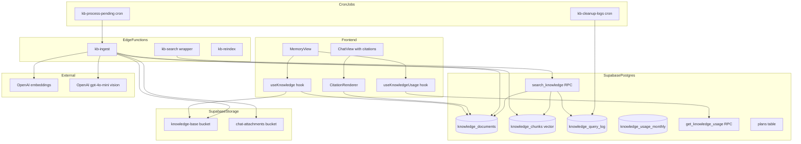
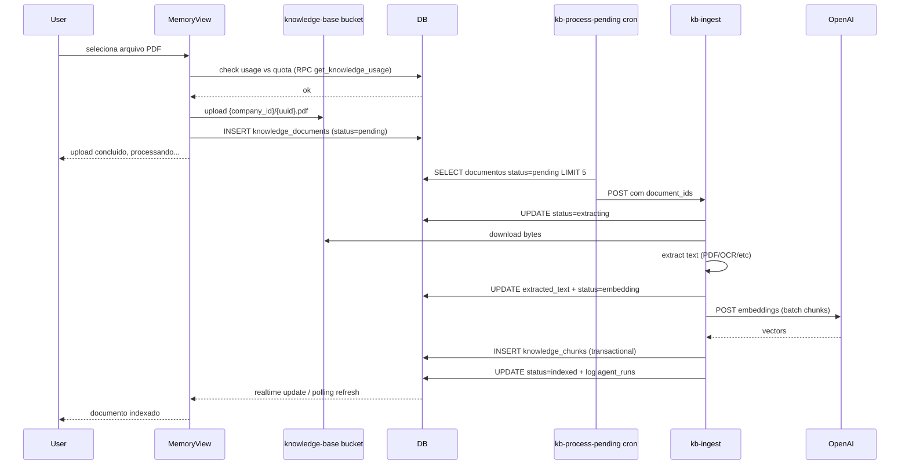
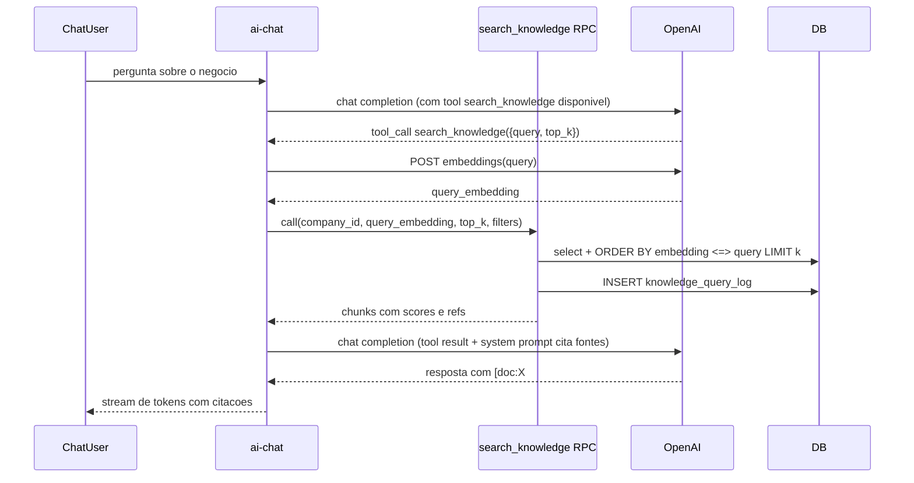
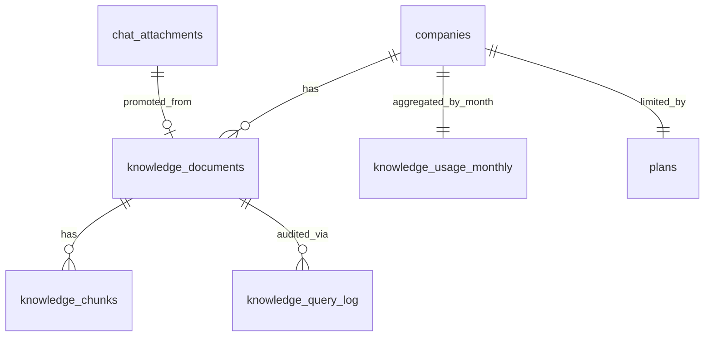
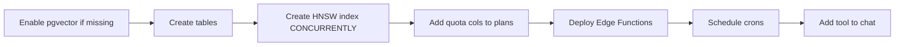

# Design Document — knowledge-base-rag

## Overview

**Purpose**: Banco de memoria longa do cliente (PDFs, planilhas, depoimentos, fotos) indexado por embeddings + pgvector e exposto a IA do Fury via tool calling. Diferencial competitivo central — nenhum concorrente entrega chat com memoria sobre artefatos arbitrarios para SMB.

**Users**: Donos de empresa sobem documentos via UI "Memoria" ou promovem anexos do chat. A IA consulta via tool `search_knowledge` durante conversas e cita fontes inline.

**Impact**: Nova area do app com pipeline async (upload -> extract -> chunk -> embed -> indexed), nova tool no chat, novo bucket privado e novas tabelas. Reusa pgvector, OpenAI embeddings e tenant guard ja estabelecidos.

### Goals
- Ingestao de PDF/DOCX/XLSX/TXT/MD/CSV/JSON/imagens com extracao + embeddings async
- Busca semantica p95<350ms ate 5k chunks por company
- Citacoes traceaveis nas respostas da IA
- Quota por plano (free/pro/enterprise) com bloqueio gracioso

### Non-Goals
- Geracao de criativos a partir do que foi recuperado (escopo de `ai-creative-generation`)
- Pre-flight de compliance sobre conteudo recuperado (escopo de spec dedicada)
- Editor de texto in-app (apenas viewer e edit de metadata)
- Sincronizacao com Drive/Dropbox/etc (manual upload + promocao do chat para v1)
- Streaming de respostas da busca (snapshot completo na resposta)

## Architecture

### Existing Architecture Analysis

- **pgvector ja disponivel**: tabela `memories` usa pgvector + RPC `search_memories` (migration 20260424000002). Reusamos extension e padrao.
- **OpenAI embeddings ja integrados**: ai-chat usa `text-embedding-3-small` direto via fetch. Reusar mesmo modelo.
- **Multi-tenant via `current_user_company_id()`**: todas tabelas filhas seguem padrao.
- **Bucket privado patterns**: `chat-attachments` e `company-assets` (briefing-onboarding) sao templates.
- **Tenant guard helper**: `_shared/briefing-tenant-guard.ts` (renomear para `tenant-guard.ts` ou copiar conceito).
- **chat-multimodal**: `chat_attachments.extracted_text` ja existe — promocao reusa.

### Architecture Pattern & Boundary Map



**Architecture Integration**:
- **Pattern**: Pipeline async (cron-driven) + RPC sincrona para busca + tool calling para IA
- **Boundaries**: KB e bounded context; consumidores (chat, futuro creative-gen) usam apenas a tool publica
- **Existing patterns preserved**: RLS, signed URLs, tenant guard, OpenAI fetch, pgvector
- **New components**: 4 tabelas + 1 RPC de busca + 1 RPC de usage + 3 Edge Functions + 1 bucket + 2 hooks + 1 view UI
- **Steering compliance**: TS strict, sem `any`, componentes <200 linhas, 4 estados visuais nos hooks

### Technology Stack

| Layer | Choice / Version | Role | Notes |
|-------|-----------------|------|-------|
| Frontend | React 18 + TanStack Query v5 + shadcn/ui | UI Memoria + citacoes inline + hooks | Reusa stack |
| Backend / Services | Supabase Edge Functions (Deno) | kb-ingest (async pipeline), kb-search (wrapper opcional), kb-reindex | Reusar `_shared/cors.ts`, `_shared/briefing-tenant-guard.ts` |
| Data / Storage | PostgreSQL 15 + pgvector + HNSW indice | 4 tabelas + 2 RPCs + indice cosseno | `vector(1536)` |
| External | OpenAI `text-embedding-3-small`, `gpt-4o-mini` (visao) | Embeddings + OCR/caption | Mesmo provider ja autenticado |
| Infra / Runtime | pg_cron + Storage privado | Pipeline polling + retencao | Bucket `knowledge-base` |

## System Flows

### Fluxo de ingestao (upload direto)



### Fluxo de busca pela IA



## Requirements Traceability

| Requirement | Summary | Components | Interfaces | Flows |
|-------------|---------|------------|------------|-------|
| 1.1-1.7 | Upload e quota | MemoryView, useKnowledge, kb-ingest, knowledge_documents | UI + Storage | Ingestao |
| 2.1-2.5 | Promocao do chat | Botao "Salvar na memoria", useKnowledge.promote | service | — |
| 3.1-3.6 | Extracao | kb-ingest (per-type strategies) | service | Ingestao |
| 4.1-4.6 | Chunking + embeddings | kb-ingest, knowledge_chunks, OpenAI client | service | Ingestao |
| 5.1-5.7 | Busca semantica + tool | search_knowledge RPC, ai-chat tool integration | API + tool | Busca |
| 6.1-6.4 | Citacoes traceaveis | system prompt, CitationRenderer | UI | — |
| 7.1-7.7 | UI Memoria | MemoryView, DocumentList, DocumentDetailDrawer | UI | — |
| 8.1-8.5 | Quota | get_knowledge_usage RPC, useKnowledgeUsage, plans extension | API + UI | — |
| 9.1-9.6 | Multi-tenant security | RLS em todas tabelas + bucket policies | — | — |
| 10.1-10.6 | Reindex + manutencao | kb-reindex, embedding_model_version, cleanup cron | service | — |

## Components and Interfaces

### Summary

| Component | Layer | Intent | Req Coverage | Key Dependencies | Contracts |
|-----------|-------|--------|--------------|------------------|-----------|
| MemoryView | UI | Listagem, upload, edit, delete de documentos | 1, 7, 8 | useKnowledge, useKnowledgeUsage | State |
| useKnowledge | Frontend hook | CRUD de documentos + upload + promote | 1, 2, 7 | Supabase client, Storage | Service |
| useKnowledgeUsage | Frontend hook | Le quota e status atual | 8 | RPC get_knowledge_usage | Service |
| CitationRenderer | UI | Substitui `[doc:X#chunk:Y]` por links + drawer | 6 | knowledge_documents | State |
| kb-ingest | Edge Fn | Pipeline async extract+chunk+embed | 1, 3, 4 | OpenAI, Storage, DB | API |
| kb-reindex | Edge Fn | Reindex sob demanda (admin/scoped) | 10 | OpenAI, DB | API |
| search_knowledge | RPC | Busca por similaridade com filtros e log | 5 | knowledge_chunks, OpenAI (no caller) | API |
| get_knowledge_usage | RPC | Quotas e uso por dimensao | 8 | knowledge_documents, plans | API |
| knowledge_documents | Data | 1 linha por arquivo, status pipeline, metadata | 1, 7 | companies | State |
| knowledge_chunks | Data | N chunks por documento com vector(1536) | 4, 5, 10 | knowledge_documents | State |
| knowledge_query_log | Data | Audit de buscas para metrica/billing | 5.5 | — | State |
| knowledge_usage_monthly | Data | Agregado mensal de tokens embedados | 8.5 | — | State |
| Bucket knowledge-base | Storage | Bytes de documentos | 1, 9 | — | State |

### Frontend / Hooks

#### useKnowledge

| Field | Detail |
|-------|--------|
| Intent | Hook canonico para listar/uploadar/editar/remover documentos da KB |
| Requirements | 1.1-1.7, 2.1-2.5, 7.1-7.5 |

**Responsibilities & Constraints**
- Listar documentos com filtros e paginacao
- Upload com validacao client-side de tamanho e mime
- Promover anexo do chat reusando storage_path
- Editar metadata (titulo, descricao, tags, is_source_of_truth)
- Remover com confirmacao (transacional via Edge Function ou SQL)
- ReadOnly para `member`

**Contracts**: Service [x]

##### Service Interface

```typescript
type KbDocStatus = 'pending' | 'extracting' | 'embedding' | 'indexed' | 'failed';
type KbDocType =
  | 'pdf' | 'docx' | 'xlsx' | 'csv' | 'json' | 'txt' | 'md'
  | 'image';

interface KnowledgeDocument {
  id: string;
  company_id: string;
  title: string;
  description: string | null;
  type: KbDocType;
  source: 'upload' | 'chat_attachment';
  source_attachment_id: string | null;
  storage_bucket: 'knowledge-base' | 'chat-attachments';
  storage_path: string;
  mime_type: string;
  size_bytes: number;
  page_count: number | null;
  tags: string[];
  is_source_of_truth: boolean;
  status: KbDocStatus;
  status_error: string | null;
  embedding_model_version: string | null;
  created_at: string;
  indexed_at: string | null;
  signed_url?: string;
}

interface KnowledgeFilters {
  type?: KbDocType[];
  tags?: string[];
  status?: KbDocStatus[];
  search?: string;
  is_source_of_truth?: boolean;
}

type KbError =
  | { kind: 'unauthorized' }
  | { kind: 'quota_exceeded'; dimension: 'storage' | 'documents' | 'embeddings' }
  | { kind: 'too_large'; maxBytes: number }
  | { kind: 'unsupported_mime' }
  | { kind: 'network'; message: string };

type Result<T, E> = { ok: true; value: T } | { ok: false; error: E };

interface UseKnowledgeReturn {
  documents: KnowledgeDocument[];
  isLoading: boolean;
  isError: boolean;
  isReadOnly: boolean;
  filter: (f: KnowledgeFilters) => void;
  upload: (file: File, meta?: Partial<Pick<KnowledgeDocument, 'title' | 'description' | 'tags'>>) => Promise<Result<KnowledgeDocument, KbError>>;
  promoteFromChat: (attachmentId: string, meta?: Partial<Pick<KnowledgeDocument, 'title' | 'description' | 'tags'>>) => Promise<Result<KnowledgeDocument, KbError>>;
  updateMetadata: (id: string, patch: Partial<Pick<KnowledgeDocument, 'title' | 'description' | 'tags' | 'is_source_of_truth'>>) => Promise<Result<KnowledgeDocument, KbError>>;
  remove: (id: string) => Promise<Result<void, KbError>>;
  retryFailed: (id: string) => Promise<Result<void, KbError>>;
}
```

- Preconditions: usuario autenticado e membro da company
- Postconditions: invalidacao de queries `kb-documents`, `kb-usage`
- Invariants: `source='chat_attachment'` implica `storage_bucket='chat-attachments'` e `source_attachment_id IS NOT NULL`

**Implementation Notes**
- Upload usa quota check otimista via `useKnowledgeUsage` antes de chamar Storage
- Promote nao copia bytes, apenas insere row apontando para o anexo
- Remove com `source='chat_attachment'` mantem o anexo de origem (R7.5)

#### useKnowledgeUsage

| Field | Detail |
|-------|--------|
| Intent | Le quotas e uso atual para alimentar UI e gates |
| Requirements | 8.1, 8.2, 8.4 |

**Contracts**: Service [x]

##### Service Interface

```typescript
type UsageDimension = 'storage' | 'documents' | 'embeddings';

interface KnowledgeUsage {
  storage: { bytes: number; max: number };
  documents: { count: number; max: number };
  embeddingsThisMonth: { tokens: number; max: number };
  status: 'ok' | 'warning' | 'blocked';
  warningDimensions: UsageDimension[];
  blockedDimensions: UsageDimension[];
}

interface UseKnowledgeUsageReturn extends KnowledgeUsage {
  isLoading: boolean;
  refetch: () => Promise<void>;
}
```

#### CitationRenderer

| Field | Detail |
|-------|--------|
| Intent | Renderiza markdown da resposta da IA substituindo refs por links + drawer |
| Requirements | 6.1, 6.2, 6.3, 6.4 |

**Contracts**: State [x]

**Responsibilities & Constraints**
- Parser regex `\[doc:([0-9a-f-]+)#chunk:(\d+)\]` na string de resposta
- Validar referencia com `knowledge_documents` (cache TanStack Query)
- Click abre `<DocumentDetailDrawer>` com chunk destacado
- Hallucinacoes (doc/chunk inexistente) renderizam badge "fonte invalida" sem quebrar texto

### Backend / Edge Functions

#### kb-ingest

| Field | Detail |
|-------|--------|
| Intent | Pipeline async: extract -> chunk -> embed -> insert chunks -> mark indexed |
| Requirements | 1.4, 1.5, 3.1-3.6, 4.1-4.6, 10.5 |

**Contracts**: API [x]

##### API Contract

| Method | Endpoint | Request | Response | Errors |
|--------|----------|---------|----------|--------|
| POST | `/functions/v1/kb-ingest` | `{ document_ids: string[] }` | `{ processed: { id, status }[] }` | 401, 422, 500 |

- Trigger: cron `kb-process-pending` a cada 30s OU chamada direta pelo `useKnowledge.upload` apos upload (best-effort)
- Auth: requer `service_role` OU JWT autenticado; usa tenant guard para validar acesso aos document_ids
- Concurrency: processa max 5 documentos por invocacao; 5 chamadas paralelas a OpenAI internamente
- Timeout: 150s; PDFs >100 paginas processados em mode incremental (ver Implementation Notes)

**Implementation Notes**
- Per-type extraction:
  - PDF: parse client-side via `pdf-parse` ou similar Deno-friendly + page tracking
  - DOCX/XLSX: bibliotecas Deno (`docx`, `xlsx`)
  - Imagens: GPT-4o-mini com prompt estruturado retornando `{ extracted_text, visual_description }`
- Chunking strategy by type (ver research.md)
- Embeddings em batch de ate 100 inputs por chamada OpenAI (limite da API)
- Custo registrado em `agent_runs` com `purpose='kb-embed'` ou `kb-extract`
- Falha em 1 documento nao bloqueia outros — `failed` + `status_error` (R3.5)

#### kb-reindex

| Field | Detail |
|-------|--------|
| Intent | Reindex scoped (1 documento, company inteira ou global) preservando busca durante operacao |
| Requirements | 10.1-10.5 |

**Contracts**: API [x]

##### API Contract

| Method | Endpoint | Request | Response |
|--------|----------|---------|----------|
| POST | `/functions/v1/kb-reindex` | `{ scope: 'document' \| 'company' \| 'global', target_id?: string, target_model?: string }` | `{ queued: number }` |

**Implementation Notes**
- Cria chunks novos com `embedding_model_version` atualizado mantendo antigos ate operacao terminar
- Apos sucesso, deleta chunks da versao antiga em transacao
- Global scope so via `service_role` + admin role check

### Backend / RPCs

#### search_knowledge

| Field | Detail |
|-------|--------|
| Intent | Top-k chunks por similaridade com filtros, citacao e audit |
| Requirements | 5.1-5.7 |

**Contracts**: API [x]

##### API Contract

| Method | Endpoint | Request | Response |
|--------|----------|---------|----------|
| RPC | `rpc/search_knowledge` | `{ p_company_id: uuid, p_query_embedding: vector(1536), p_top_k: int, p_filters: jsonb }` | `KnowledgeSearchResult[]` |

```typescript
interface KnowledgeSearchResult {
  chunk_id: string;
  document_id: string;
  document_title: string;
  document_type: KbDocType;
  chunk_text: string;
  chunk_index: number;
  page_number: number | null;
  score: number; // 1 - cosine_distance
  is_source_of_truth: boolean;
  // signed URL gerada pelo caller via supabase.storage.createSignedUrl
}
```

- Preconditions: `p_top_k` em [1, 20], filtros validados
- Postconditions: `INSERT knowledge_query_log` com query, top_k, scores, duration
- Performance target: p95 < 350ms para 5k chunks (R5.6) — assegurado por HNSW index
- Boost de `is_source_of_truth`: aplicado via `score + boost_factor` (default 0.05)

#### get_knowledge_usage

| Field | Detail |
|-------|--------|
| Intent | Retorna uso vs limites em uma chamada |
| Requirements | 8.1, 8.2, 8.4 |

**Contracts**: API [x]

##### API Contract

```typescript
interface UsagePayload {
  storage: { bytes: number; max: number };
  documents: { count: number; max: number };
  embeddings_this_month: { tokens: number; max: number };
  status: 'ok' | 'warning' | 'blocked';
  warning_dimensions: string[];
  blocked_dimensions: string[];
}
```

### Tool no Chat

#### search_knowledge tool (exposto via tools.ts)

| Field | Detail |
|-------|--------|
| Intent | Wrapper expondo `search_knowledge` como tool OpenAI no `ai-chat` |
| Requirements | 5.7, 6.1 |

**Contracts**: API [x]

```typescript
// Adicionado em supabase/functions/_shared/tools.ts
{
  type: 'function',
  function: {
    name: 'search_knowledge',
    description: 'Busca semantica em documentos do cliente (PDFs, planilhas, depoimentos). Use quando o usuario perguntar sobre dados especificos do negocio que possam estar em arquivos. NUNCA use para historico de conversas — para isso use search_memories.',
    parameters: {
      type: 'object',
      properties: {
        query: { type: 'string', description: 'Pergunta em linguagem natural' },
        top_k: { type: 'integer', minimum: 1, maximum: 20, default: 8 },
        filters: {
          type: 'object',
          properties: {
            type: { type: 'array', items: { type: 'string' } },
            tags: { type: 'array', items: { type: 'string' } },
            is_source_of_truth: { type: 'boolean' },
          },
        },
      },
      required: ['query'],
    },
  },
}
```

System prompt instrui a IA a citar resultados como `[doc:<document_id>#chunk:<chunk_index>]`.

### UI / Pages

| Component | Block Type | Notes |
|-----------|-----------|-------|
| MemoryView | Summary-only | Layout principal: header com upload + filtros, DocumentList paginada, DocumentDetailDrawer |
| DocumentUploadDialog | Summary-only | Drag-drop, validacao client-side, mostra quota |
| DocumentList | Summary-only | Item com titulo, tipo icon, tags, status badge, source-of-truth toggle |
| DocumentDetailDrawer | Summary-only | Preview do texto extraido com paginacao, edit metadata, retry failed, delete |
| KnowledgeUsageBanner | Summary-only | Aparece quando status='warning' ou 'blocked' |
| CitationRenderer | Summary-only | Wrapper de mensagens da IA — substitui `[doc:X#chunk:Y]` por componentes clicaveis |

## Data Models

### Domain Model
- **Aggregate root**: `KnowledgeDocument` (1:N `KnowledgeChunk`)
- **Invariantes**:
  - `source='chat_attachment'` implica `storage_bucket='chat-attachments'` e `source_attachment_id` populado
  - `source='upload'` implica `storage_bucket='knowledge-base'`
  - Chunks so referenciam documents da mesma `company_id` (validado em RLS)
  - `embedding_model_version` deve ser igual entre todos chunks de um documento

### Logical Data Model



- Cardinalidade: `companies` 1:N `knowledge_documents` 1:N `knowledge_chunks`
- Cascade: ON DELETE CASCADE em todas filhas
- Audit: `knowledge_query_log` retem 90 dias (cron de limpeza)
- Aggregate `knowledge_usage_monthly` populado via cron mensal a partir de `agent_runs`

### Physical Data Model

| Tabela | Colunas-chave | Indexes | RLS |
|--------|--------------|---------|-----|
| `knowledge_documents` | `id PK`, `company_id FK`, `title`, `type`, `source`, `source_attachment_id`, `storage_bucket`, `storage_path UNIQUE`, `mime_type`, `size_bytes`, `tags text[]`, `is_source_of_truth bool`, `status`, `status_error`, `embedding_model_version`, `created_at`, `indexed_at` | `(company_id, status)`, `(company_id, created_at DESC)`, GIN em `tags` | SELECT/INSERT/UPDATE/DELETE por `company_id = current_user_company_id()` |
| `knowledge_chunks` | `id PK`, `document_id FK`, `company_id FK (denormalizado)`, `chunk_index`, `page_number`, `chunk_text`, `embedding vector(1536)`, `embedding_model_version`, `token_count`, `created_at` | HNSW em `embedding vector_cosine_ops`, `(document_id, chunk_index)`, `company_id` | SELECT por company; INSERT/UPDATE/DELETE via service_role apenas (Edge Functions) |
| `knowledge_query_log` | `id PK`, `company_id FK`, `user_id`, `query_preview text`, `top_k`, `chunk_ids uuid[]`, `top_score`, `duration_ms`, `created_at` | `(company_id, created_at DESC)` | SELECT por company; INSERT via service_role |
| `knowledge_usage_monthly` | `company_id PK partial`, `month`, `embeddings_tokens`, `documents_count`, `storage_bytes` | `(company_id, month DESC)`, unique `(company_id, month)` | SELECT por company; INSERT/UPDATE via service_role |

**Plans extension** (ALTER existing `plans`):
- `kb_storage_bytes_max bigint`
- `kb_documents_max int`
- `kb_embeddings_per_month_max bigint`

**Storage**:
- Bucket privado `knowledge-base`, max 25MB/arquivo, mime allowlist
- Path: `{company_id}/{document_id}.{ext}`
- Policies replicadas dos buckets existentes

### Data Contracts & Integration

- API Data Transfer: tipos TypeScript em `src/types/knowledge.ts`, schemas Zod em `src/lib/knowledge-schemas.ts`
- Eventos: nenhum publicado externamente. Cron consome `pending` queue.
- Tool calling: integracao via `tools.ts` no `_shared`

## Error Handling

### Error Strategy
- Fail-fast no client (Zod) antes de qualquer Storage write
- Pipeline async tolera falha por documento (R3.5) — outros seguem
- Quota gate antes de qualquer write (R8.3)

### Error Categories
- **User errors (4xx)**:
  - Arquivo > 25MB ou mime nao suportado
  - Quota exceeded em qualquer dimensao
  - Reference invalido em `promoteFromChat` (anexo nao existe ou nao acessivel)
- **System errors (5xx)**:
  - Falha de Storage upload -> rollback do row
  - OpenAI rate limit -> backoff exponencial + retry, marca `failed` se exceder 3 tentativas
  - Timeout de extracao -> documento marcado `failed` com `status_error` claro
- **Business logic (422)**:
  - Tentativa de remover documento durante reindex global -> 422 "operation in progress"

### Monitoring
- `agent_runs` recebe entrada por chamada OpenAI (`kb-embed`, `kb-extract`, `kb-vision`)
- Logs do Supabase para erros de RLS/Storage
- Alerta p95 da `search_knowledge` >350ms

## Testing Strategy

### Unit
- Chunker: 800/100 com overlap correto, page boundaries respeitadas, CSV linha-aware
- Citation parser: valida regex, lida com refs invalidas
- Quota helper: warning em 80%, block em 100%, dimensoes corretas
- Tipo guard: invariants `source` vs `storage_bucket`

### Integration
- E2E ingest: upload PDF -> aguarda cron -> verifica chunks criados com embeddings
- Promote: anexo do chat vira KB sem duplicar bytes
- Search: top-k retorna ordem correta, boost de source-of-truth aplica
- Reindex: chunks antigos preservados ate novos prontos
- Quota: bloqueio em 100%, unbloqueia apos delete

### E2E
- Wizard completo: upload de 3 docs diferentes, busca via chat, citacao clicavel abre drawer
- Cross-tenant: usuario A nao recebe chunks da company B (RLS + RPC)

### Performance
- p95 search_knowledge < 350ms com seed de 5k chunks
- Pipeline ingest: PDF 50 paginas processado em < 60s

## Security Considerations
- Tenant isolation: RLS em todas tabelas; bucket policies por path; tenant guard nas Edge Functions com service_role (R9.4)
- Service role: kb-ingest e kb-reindex usam service_role mas validam tenant via JWT antes de qualquer operacao
- Logs: ofuscacao de `chunk_text` em logs estruturados (R9.5) — usar helper `_shared/log-redact.ts`
- Signed URLs: TTL max 1h; nunca paths brutos
- Promotion safety: ao promover anexo do chat, validar `chat_attachments.company_id == current_user_company_id()` antes de criar referencia

## Performance & Scalability
- HNSW index em `vector(1536)` com `m=16, ef_construction=64`
- Cache TanStack Query 5min para `kb-documents` e `kb-usage`
- Cron `kb-process-pending` a cada 30s com batch=5 documentos
- Limite de concurrency OpenAI = 5 chamadas paralelas por company
- Cron mensal agrega `agent_runs` -> `knowledge_usage_monthly` (1o dia do mes 02:00 UTC)
- Cleanup `knowledge_query_log` > 90 dias (cron diario)

## Migration Strategy



- Phase 1: schema + RLS (zero impact)
- Phase 2: Edge Functions deploy
- Phase 3: tool registration em `tools.ts` + system prompt update
- Phase 4: UI MemoryView lancada
- Rollback: feature flag no system prompt remove a tool da lista exposta a IA
